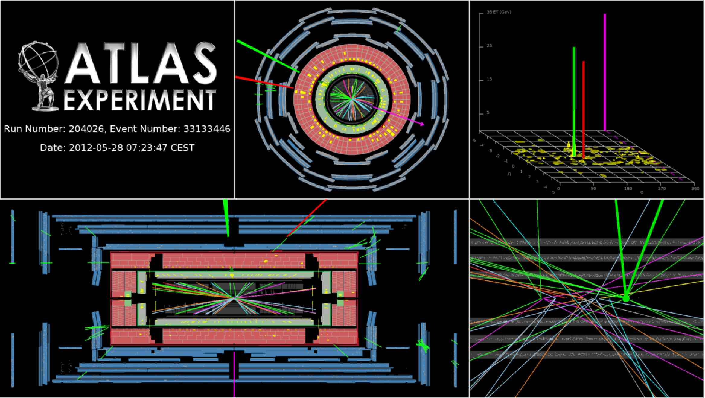

# Analyses

Histogram Analyser focuses on four physics processes; the signal HWW and three background processes WW, ttbar and Z.  Let's take a look at these processes. 

## HWW

The [Higgs boson](https://home.cern/topics/higgs-boson) appears as a consequence of the breaking of [electroweak symmetry](https://en.wikipedia.org/wiki/Electroweak_interaction) and is responsible
for giving masses to all other massive particles. The central role played by the Higgs boson in the [Standard Model](https://home.cern/about/physics/standard-model) 
explains why the understanding of this particle is a centrepiece of the [LHC](https://home.cern/topics/large-hadron-collider) physics programme.

The Higgs boson interacts with all the massive elementary particles of the Standard Model and so it has many different processes through which it can decay.
The most likely possibility is for the Higgs to decay into a pair of [W bosons](https://home.cern/about/physics/w-boson-sunshine-and-stardust) 
which happens about 23% of the time for a Higgs boson with a mass of 126 GeV.
The W bosons can subsequently decay either into a [quark](https://en.wikipedia.org/wiki/Quark) and an [antiquark](https://en.wikipedia.org/wiki/Antimatter) or into a charged [lepton](https://en.wikipedia.org/wiki/Lepton) and a [neutrino](https://en.wikipedia.org/wiki/Neutrino).

The signal process in Histogram Analyser is the Higgs boson decaying into 2 W bosons which subsequently decay into leptons and neutrinos

H→WW→ℓνℓν (ℓ=electron or muon).

The major background contributions to the search in this decay mode are top-pair production, WW and W+jet events. Out of these
three processes, the first two contain two isolated high-pT leptons from W boson decays, which is also the signature of the signal, while for the
W+jets background, one of the jet decay products might be
mistaken for an isolated high-pT lepton. 

Event display: event satisfying all the selection criteria for events in the Higgs + zero jets + electron + muon channel. The reconstructed lepton pT values are 33 and 29 GeV for the electron and the muon, respectively. The reconstructed missing transverse momentum is 35 GeV.

## WW
W boson pair production occurs via

* **quark–antiquark annihilation** q + qbar -> W+W-
 
* **diphoton process**  γγ -> W+W- 

* **gluon fusion** g + g -> W+W- (~5%)

The production of pairs of [vector bosons](https://en.wikipedia.org/wiki/Vector_boson) is crucial to understand both in order to check the [gauge structure](https://en.wikipedia.org/wiki/Gauge_theory) of the Standard Model and in the search for [new physics](https://en.wikipedia.org/wiki/Physics_beyond_the_Standard_Model).  Production of vector boson pairs and the associated particles from their decay, enter as irreducible backgrounds for many Higgs and new physics searches. 

W bosons can decay either
* [leptonically](https://en.wikipedia.org/wiki/Lepton): into an [electron](https://en.wikipedia.org/wiki/Electron) or [muon](https://en.wikipedia.org/wiki/Muon) and [neutrino](https://en.wikipedia.org/wiki/Neutrino). 
* [hadronically](https://en.wikipedia.org/wiki/Hadron): into an [up-type quark](https://en.wikipedia.org/wiki/Quark) and a [down-type quark](https://en.wikipedia.org/wiki/Quark).

If a W boson decays leptonically, the final state is characterised by the presence of a highly energetic isolated lepton and large missing transverse momentum due to the neutrino(s) escaping detection. 

If a W boson decays hadronically, the final state is characterised by the presence of two jets due to the two quarks.

In Histogram Analyser we are just considering lepton decay, so WW process will be seen in the electron-electron (ee), muon-muon (mm) and electron-muon (em) channel.

Processes with leptons and missing energy are typical signatures of many new physics models, of which [supersymmetry](https://home.cern/about/physics/supersymmetry) is a classic example. Knowledge of Standard Model processes which possess multiple leptons and missing energy is crucial in the quest to discover or rule out these models.

Event display: A WW candidate event in the electron muon final state.

## ttbar

[Top](https://en.wikipedia.org/wiki/Top_quark) pair production is interesting because it is a good test of the Standard Model.

It is important for discrimination between different Monte-Carlo data simulation generators,  [QCD](https://en.wikipedia.org/wiki/Quantum_chromodynamics) models and parton distribution functions.

In addition, top pair production is an important background in various Higgs boson analyses as well as beyond the Standard Model searches.  It is therefore crucial to understand this process in detail. 

In the Standard Model, the top-quark generally decays into a [W boson](https://en.wikipedia.org/wiki/W_and_Z_bosons) and a 
[b-quark](https://en.wikipedia.org/wiki/Bottom_quark).

W bosons can decay either
* [leptonically](https://en.wikipedia.org/wiki/Lepton): into an [electron](https://en.wikipedia.org/wiki/Electron) or [muon](https://en.wikipedia.org/wiki/Muon) and [neutrino](https://en.wikipedia.org/wiki/Neutrino). 
* [hadronically](https://en.wikipedia.org/wiki/Hadron): into an [up-type quark](https://en.wikipedia.org/wiki/Quark) and a [down-type quark](https://en.wikipedia.org/wiki/Quark).

If a W boson decays leptonically, the final state is characterised by the presence of a highly energetic isolated lepton and large missing transverse momentum due to the neutrino(s) escaping detection. 

If a W boson decays hadronically, the final state is characterised by the presence of two jets due to the two quarks.

The two b-quarks from the top-quark decays will be seen as two jets in the final state.  Jets identified as originating from b-quarks are termed b-tagged jets.   

* If both W bosons decay leptonically two jets are seen, originating from the b-quarks.
* If both W bosons decay hadronically, six jets are seen, two from each W and two from the b-quarks.
* If the decay is semi-leptonic, one W boson decays leptonically and the other hadronically, four jets are seen.

Event display: A top pair candidate event recorded by ATLAS with LHC stable beams at a collision energy of 13 TeV. The red line shows the path of a muon with transverse momentum around 140 GeV through the detector. The green line shows the path of an electron with transverse momentum around 170 GeV through the detector. The green and yellow bars indicate energy deposits in the liquid argon and scintillating-tile calorimeters, from these deposits 3 jets are identified with transverse momenta between 30 and 80 GeV. Two of the jets are identified as having originated from b-quarks. Tracks reconstructed from hits in the inner tracking detector are shown as arcs curving in the solenoidal magnetic field. 

## Z

The [W](http://home.cern/about/physics/w-boson-sunshine-and-stardust) and [Z](http://home.cern/about/physics/z-boson) bosons are together known as the weak or the intermediate vector bosons. These Standard Model elementary particles mediate the weak interaction.  

The production of Z bosons at the LHC is due to

* **Drell-Yan **: qqbar → Z/γ∗ → μ+μ− (65%).  A quark of one hadron and an antiquark of another hadron annihilate, creating a virtual photon or Z boson which then decays into a pair of oppositely-charged leptons. 

* **Quark gluon scattering**: qg → qγ∗/Z → qμ+μ− (35%). A quark and a gluon interact, creating a virtual photon or Z boson which then decays into a pair of oppositely-charged leptons. 

A Z boson is neutral and so the sum of the charges of its decay products must be zero.  A Z boson decays in three ways

* **quark-antiquark pair** (70%). These appear as jets.  If the jets are identified as originating from b-quarks they will be b-tagged.

* **neutrino-antineutrino pair** (20%).  Neutrinos do not interact and so are very difficult to detect.  This decay mode can be identified with missing transverse momentum.

* **lepton-antilepton pairs** (10%).  The three lepton-pair types are equally probable, electron-positron, muon-antimuon, and tau-antitau pairs.  In Histogram Analyser this decay mode will be seen in the electron-electron (ee) and muon-muon (mm) channel.

Event display: Candidate event with a Z boson decaying to muon pairs, recoiling against missing transverse energy (MET). The muon candidates have transverse momenta of 50 and 126 GeV.
The invariant mass of the two muons attributed to the Z candidate is 94 GeV; the MET is measured to be 161 GeV. 

