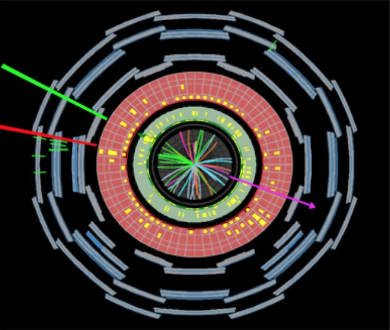
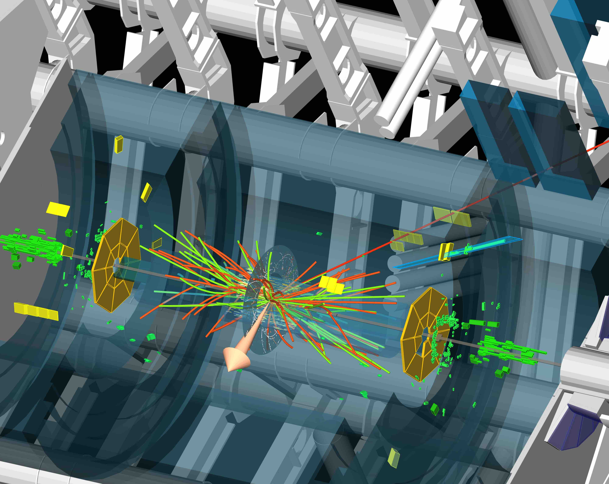
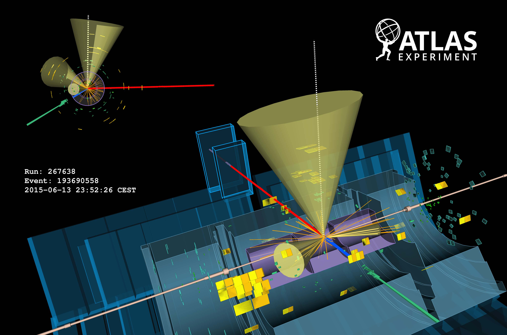
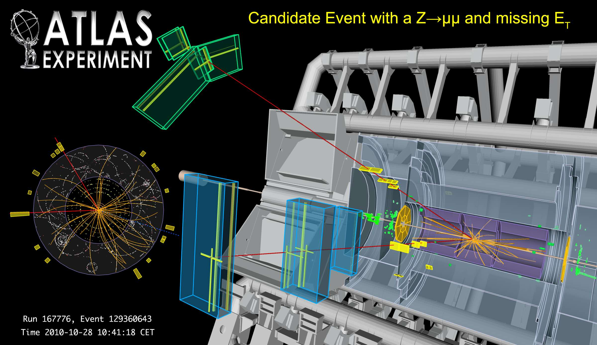

# Analyses

Histogram Analyser focusses on four physics processes; the signal $$H\rightarrow W^+W^-$$ and three background processes $$WW$$, $$t\bar t$$ and $$Z$$/Drell-Yan.
Let's take a look at these processes. 

## $$H\rightarrow W^+W^-$$

The [Higgs boson](https://home.cern/topics/higgs-boson) is an excitation of the quantum field responsible for the breaking of [electroweak symmetry](https://en.wikipedia.org/wiki/Electroweak_interaction).
This field is responsible for giving masses to fundamental particles.

The Higgs boson interacts with all  Standard Model elementary particles having mass.
Thus, it can decay through many different processes.
One of the most likely things to happen is that the Higgs decays into a pair of [W bosons](https://home.cern/about/physics/w-boson-sunshine-and-stardust). 
This happens about 23% of the time for a Higgs boson with a mass of 126 GeV.
The W bosons can subsequently decay either into a quark-antiquark, a [lepton](https://en.wikipedia.org/wiki/Lepton)-[antineutrino](https://en.wikipedia.org/wiki/Neutrino), or an antilepton-neutrino pair.

From here on, we will refer to a particle and its [antiparticle](https://en.wikipedia.org/wiki/Antiparticle) collectively by just the particle's name.
So, When we talk about quarks we mean quarks and antiquarks.
It is a shorthand that physicists adopt for brevity. 

The signal process in Histogram Analyser is the Higgs boson decaying into 2 W bosons which subsequently decay into leptons and neutrinos:

$$H\rightarrow W^+W^-\rightarrow l^+\nu l^-\bar\nu$$ ($$l$$=electron or muon).

The major background contributions to the search in this decay mode are top-pair ($$t\bar t$$) production, $$WW$$ and $$Z$$+jets events. 
All of these processes contain two isolated high-$$p_\text{T}$$ leptons from $$W$$ boson decays, which is also the signature of the signal.

There is also the $$W$$+[jets](https://en.wikipedia.org/wiki/Jet_(particle_physics) background, where one of the jet decay products might be mistaken for an isolated high-$$p_\text{T}$$ lepton.
Its contribution is small and is neglected here.

The term $$p_\text{T}$$ stands for transverse momentum, the component of momentum perpendicular to the beam line. 
In proton-proton collisions the overall momentum along the beamline is not known.
This is because protons are composite particles consisting of many so-called partons (quarks and gluons).
Each of the partons carries an unknown fraction of the protons momentum.
When two protons collide it is actually the partons that interact.
However, their exact momentum along the beamline is unknown.
We only know that the overall momentum perpendicular to the beamline is zero before the collision.
Thus, it is the only momentum variable that has a precise meaning in a proton-proton collision.

Isolation is important because it indicates where the lepton stems from.
For example, an isolated electron is likely to originate from $$Z$$ boson, $$W$$ boson, $$\tau$$-lepton or muon.  
In contrast, a non-isolated electron is likely to originate from $$b$$-hadron or $$c$$-hadron decays.

Event display of an event satisfying all the selection criteria for events in the Higgs + zero Jets + electron + muon channel. 
The reconstructed lepton $$p_\text{T}$$ values are 33 GeV for the electron (green track) and 29 GeV for the muon (red track).
The reconstructed missing transverse momentum (magenta arrow) is 35 GeV.

## $$WW$$
$$W$$ boson pair production occurs via

* **quark–antiquark annihilation** $$q\bar q \rightarrow W^+W^-$$
 
* **diphoton process**  $$\gamma\gamma\rightarrow W^+W^-$$

* **gluon fusion** $$gg\rightarrow W^+W^-$$

[Vector boson](https://en.wikipedia.org/wiki/Vector_boson) pair production is an important process for checks of the [gauge structure](https://en.wikipedia.org/wiki/Gauge_theory) of the Standard Model and the search for [new physics](https://en.wikipedia.org/wiki/Physics_beyond_the_Standard_Model).
It is an irreducible background for many Higgs and new physics searches. 

W bosons can decay either
* [leptonically](https://en.wikipedia.org/wiki/Lepton): into an [electron](https://en.wikipedia.org/wiki/Electron) or [muon](https://en.wikipedia.org/wiki/Muon) and [neutrino](https://en.wikipedia.org/wiki/Neutrino). 
* [hadronically](https://en.wikipedia.org/wiki/Hadron): into an [up-type quark](https://en.wikipedia.org/wiki/Quark) and a [down-type quark](https://en.wikipedia.org/wiki/Quark).

If a W boson decays leptonically, the final state is characterised by the presence of a highly energetic isolated lepton and large missing transverse momentum due to the neutrino(s) escaping detection. 

If a W boson decays hadronically, the final state is characterised by the presence of two jets due to the two quarks.

In Histogram Analyser we are just considering lepton decay, so WW process will be seen in the electron-electron (ee), muon-muon (mm) and electron-muon (em) channel.

Processes with leptons and missing energy are typical signatures of many new physics models, of which [supersymmetry](https://home.cern/about/physics/supersymmetry) is a classic example. Knowledge of Standard Model processes which possess multiple leptons and missing energy is crucial in the quest to discover or rule out these models.

Event display: A WW candidate event in the electron muon final state.  The electron and muon candidates have transverse momenta of 21 and 68 GeV respectively.  The arrow indicates the missing transverse momentum, which is measured to be 69 GeV.  

## ttbar

Due to its high mass and short lifetime, the [top quark](https://press.cern/backgrounders/top-quark) provides a unique environment to study a bare quark. 

It is important for discrimination between different Monte-Carlo data simulation generators,  [QCD](https://en.wikipedia.org/wiki/Quantum_chromodynamics) models and parton distribution functions.

In addition, top pair production is an important background in various Higgs boson analyses as well as beyond the Standard Model searches.  It is therefore crucial to understand this process in detail. 

In the Standard Model, the top-quark generally decays into a [W boson](https://en.wikipedia.org/wiki/W_and_Z_bosons) and a 
[b-quark](https://en.wikipedia.org/wiki/Bottom_quark).

As we said before, W bosons can decay either
* [leptonically](https://en.wikipedia.org/wiki/Lepton): into an [electron](https://en.wikipedia.org/wiki/Electron) or [muon](https://en.wikipedia.org/wiki/Muon) and [neutrino](https://en.wikipedia.org/wiki/Neutrino). 
* [hadronically](https://en.wikipedia.org/wiki/Hadron): into an [up-type quark](https://en.wikipedia.org/wiki/Quark) and a [down-type quark](https://en.wikipedia.org/wiki/Quark).

The two b-quarks from the top-quark decays will be seen as two jets in the final state.  Jets identified as originating from b-quarks are termed b-tagged jets.  Additional jets in ttbar events can originate from gluon radiation.

* If both W bosons decay leptonically two jets are seen, originating from the b-quarks.
* If both W bosons decay hadronically, six jets are seen, two from each W and two from the b-quarks.
* If the decay is semi-leptonic, one W boson decays leptonically and the other hadronically, four jets are seen.

Event display: A top pair candidate event recorded by ATLAS with LHC stable beams at a collision energy of 13 TeV. The red line shows the path of a muon with transverse momentum around 140 GeV through the detector. The green line shows the path of an electron with transverse momentum around 170 GeV through the detector. The green and yellow bars indicate energy deposits in the liquid argon and scintillating-tile calorimeters, from these deposits 3 jets are identified with transverse momenta between 30 and 80 GeV. Two of the jets are identified as having originated from b-quarks.  

## Z/DY

The [W](http://home.cern/about/physics/w-boson-sunshine-and-stardust) and [Z](http://home.cern/about/physics/z-boson) bosons are together known as the weak or the intermediate vector bosons. These Standard Model elementary particles mediate the weak interaction.  

The production of Z bosons at the LHC is due to

* **Drell-Yan **: qqbar → Z/γ∗ → μ+μ− (65%).  A quark of one proton and an antiquark of another proton annihilate, creating a [virtual photon](https://en.wikipedia.org/wiki/Virtual_particle) or Z boson which then decays into a pair of oppositely-charged leptons. 

* **Quark gluon scattering**: qg → qγ∗/Z → qμ+μ− (35%). A quark and a [gluon](https://en.wikipedia.org/wiki/Gluon) interact, creating a virtual photon or Z boson which then decays into a pair of oppositely-charged leptons. 

A Z boson is neutral and so the sum of the charges of its decay products must be zero.  A Z boson decays in three ways

* **quark-antiquark pair** (70%). These appear as jets.  If the jets are identified as originating from b-quarks they will be b-tagged.

* **neutrino-antineutrino pair** (20%).  Neutrinos do not interact and so are very difficult to detect.  This decay mode can be identified with missing transverse momentum.

* **lepton-antilepton pairs** (10%).  The three lepton-pair types are equally probable, [electron](https://en.wikipedia.org/wiki/Electron)-positron, [muon](https://en.wikipedia.org/wiki/Muon)-antimuon, and [tau](https://en.wikipedia.org/wiki/Tau_(particle)-antitau pairs.  

In Histogram Analyser the latter decay mode will be seen in the electron-electron (ee) and muon-muon (mm) channel.  Electrons and muons are much easier to isolate and measure than taus.

Event display: Candidate event with a Z boson decaying to muon pairs, recoiling against missing transverse energy (MET). The muon candidates have transverse momenta of 50 and 126 GeV.
The invariant mass of the two muons attributed to the Z candidate is 94 GeV; the MET is measured to be 161 GeV. 

