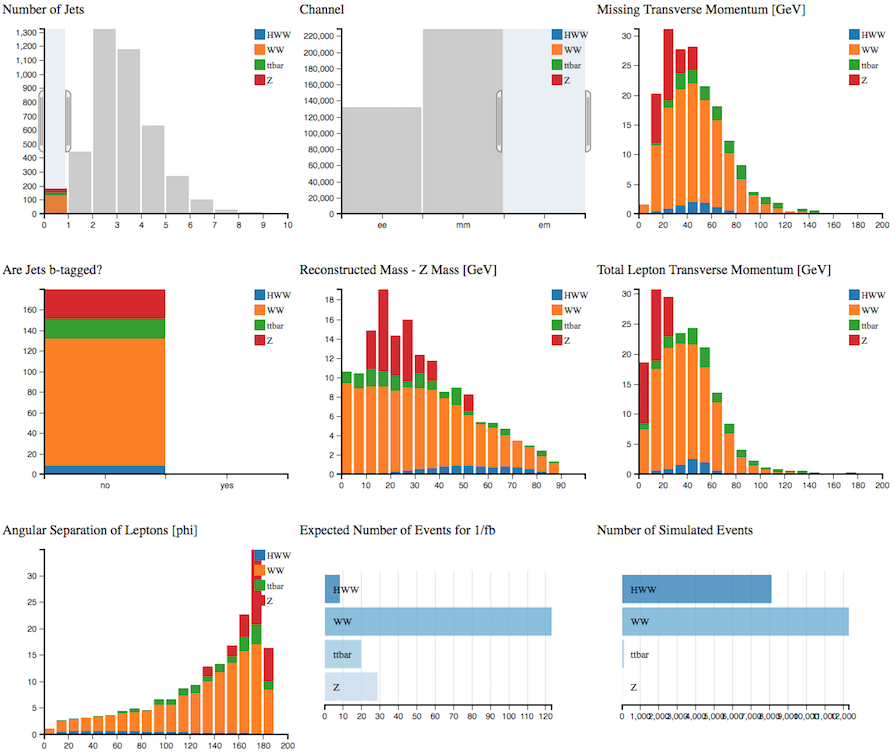

# Find the Higgs

Follow the steps of a real ATLAS analysis using Histogram Analyser

**H->WW->ℓνℓν** (ℓ = electron, muon)

We are looking for a Higgs boson which decays into 2 W bosons which subsequently decay into leptons and neutrinos. 

The major background contributions to the search in this decay mode are top (top quark pair and W+top quark), WW and W+jet events.

As a first step we are going to try and select the background processes, to understand them better.

**Use the cursor to implement the following cuts, one by one.
As you apply the cuts, you should see the distributions changing.**  

Try and understand why each of the distributions changes.  Think of the physics motivating the cut.

**To clear your selection on a specific histogram click on some white background within the histogram area. **

**To clear all your selections click on Histogram Analyser under Get Started in the main top menu.**

## Analysis 1:

If we consider two W-bosons decaying leptonically, the final state is characterised by the presence of two highly energetic leptons, large missing transverse momentum and 2 jets from the 2 b-quarks.

Select: 
* **2 jets**
* **Are jets b-tagged = yes**
* **Missing Transverse Momentum > 40GeV**
* **Only electron-muon (em) channel**

This is the top-quark background.

## Analysis 2:

**Clear your selection**

Then select: 
* **0 jets**
* **Only electron-muon (em) channel**

This is the WW background.

