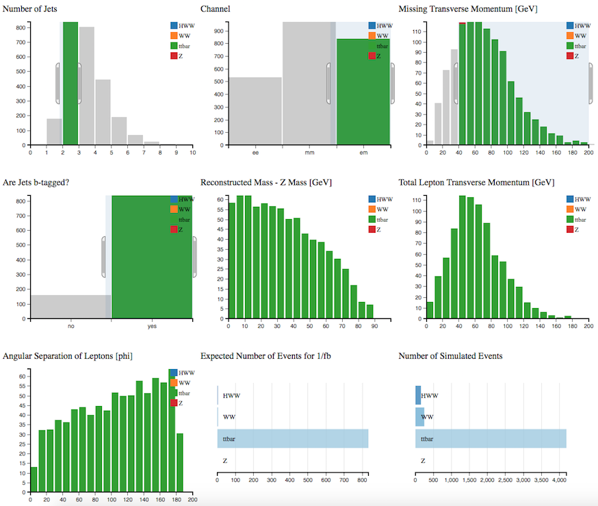

# Find the Higgs

Follow the steps of a real ATLAS analysis. 

**H->WW->ℓνℓν**

We are looking for a Higgs which decays into 2 W bosons which subsequently decay into leptons and neutrinos. 

The major background contributions to the search in this decay mode are top, WW and W+jet events.

As a first step we are going to try and select the background processes, to understand them better.

Use the cursor to implement the following cuts, one by one.
As you apply the cuts, you should see the distributions changing.  

## Analysis 1:

If we consider both W-boson decay leptonically, the final state is characterised by the presence of two highly energetic leptons, large MET and 2 jets from the 2 b-quarks.

Select: 
* **2 jets**
* **B-tag**
* **MET > 40GeV**
* **Only electron-muon (em) channel**

This is the top-quark background.
## Analysis 2:
Clear your previous selection by clicking on App Analyser under Get Started in the main top menu.

Select: 
* **0 jets**
* **No B-tag**
* **MET < 20GeV**
* **Only electron-muon (em) channel**
* **DeltaPhiLL > 160**

We also see that we have about 100 HWW events and 800 WW events left after the cuts.

Look at the ZWindow.
There are 2 peaks.  One at 10-25 GeV and the other at 35-40 GeV.

**Why do we see no Z in the N events histo, but we do see Z in the fiducial cross section? **

Now add a cut requiring Zwindow > 60GeV

The total number of WW events has reduced to around 100 but the sample is now very pure.

This is the WW background.

## Analysis 3:

Now see if you can remove the backgrounds to get a pure a sample of HWW as you can.

