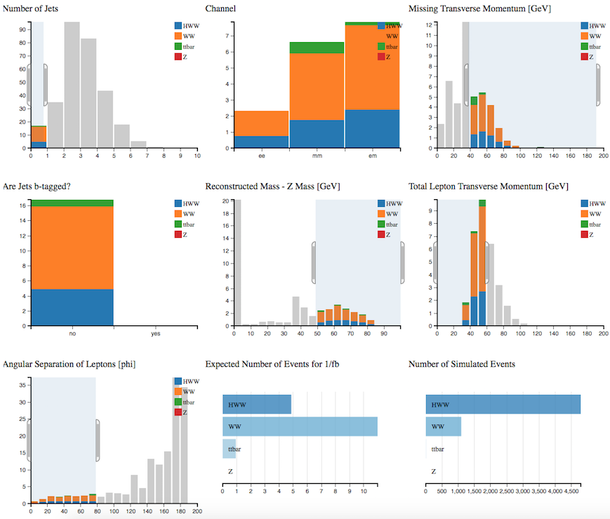
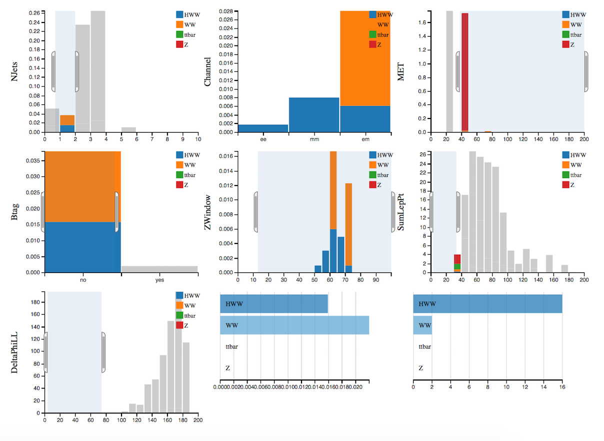

# Find the Higgs

Now let's try to separate the signal from the background:

## Higgs boson + 0 jet
We want to select events which contain two leptons, high missing transverse momentum and no jets.  

Select: 

* Number of Jets = 0
* Missing Transverse Momentum > 40 GeV
* Total Lepton Transverse Momentum < 60 GeV
* Angular Separation of Leptons < 80
* Reconstructed Mass - Z Mass > 15 GeV

The dominant background after all cuts in the
Higgs boson + 0 jet channel comes from WW
production, with a smaller contribution from Z and top events.

## Higgs boson + 1 jet

We want to select events which contain 1 non b-tagged jet.

Select: 

* Number of Jets = 1
* Are Jets b-tagged = no
* electron-muon channel only
* Missing Transverse Momentum > 30 GeV
* Total Lepton Transverse Momentum < 90 GeV
* Angular Separation of Leptons < 80

The dominant background after all cuts in the
Higgs boson + 1 jet channel comes from WW
production.  

## Have a go yourself !

Perhaps try the HWW + 0 jet, but separate into leptonic channels and tune the cuts to maximise the number of HWW events with minimum background.  

Or try something completely different...

