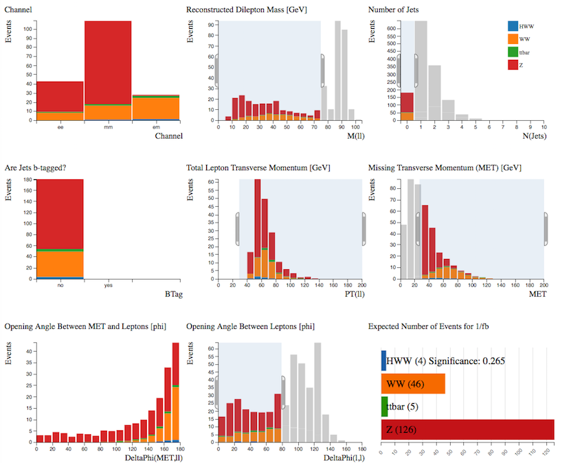

# Find the Higgs

Follow the steps of a real ATLAS analysis using Histogram Analyser

**H->WW->ℓνℓν** (ℓ = electron, muon)

We are looking for a Higgs boson which decays into 2 W bosons which subsequently decay into leptons and neutrinos. 

The major background contributions to the search in this decay mode are top (top quark pair and W+top quark), WW and W+jet events.

**Use the cursor to implement the following cuts, one by one.
As you apply the cuts, you should see the distributions changing.**  

Try and understand why each of the distributions changes.  Think of the physics motivating the cut.

**To clear your selection on a specific histogram click on some white background within the histogram area. **

**To clear all your selections click on Histogram Analyser under Get Started in the main top menu.**

Now let's try to separate the signal from the background using Histogram Analyser

## Higgs boson + 0 jet
We want to select events which contain two leptons, high missing transverse momentum and no jets.  

Select: 

* Number of Jets = 0
* Angular Separation of Leptons < 80
* Missing Transverse Momentum > 40 GeV
* Total Lepton Transverse Momentum > 30 GeV
* Reconstructed Mass - Z Mass > 15 GeV

The dominant background after all cuts in the
Higgs boson + 0 jet channel comes from WW
production, with a smaller contribution from Z and top events.

## Higgs boson + 1 jet

We want to select events which contain 1 non b-tagged jet.

Select: 

* Number of Jets = 1
* Are Jets b-tagged = no
* electron-muon channel only
* Total Lepton Transverse Momentum > 30 GeV
* Angular Separation of Leptons < 80
* Reconstructed Mass - Z Mass > 20 GeV

The dominant background after all cuts in the
Higgs boson + 1 jet channel comes from top pair
production.  

## Have a go yourself !

Perhaps try the H→WW + 0 jet, but separate into leptonic channels and tune the cuts to maximise the number of H→WW events with minimum background.  

Or try something completely different...

