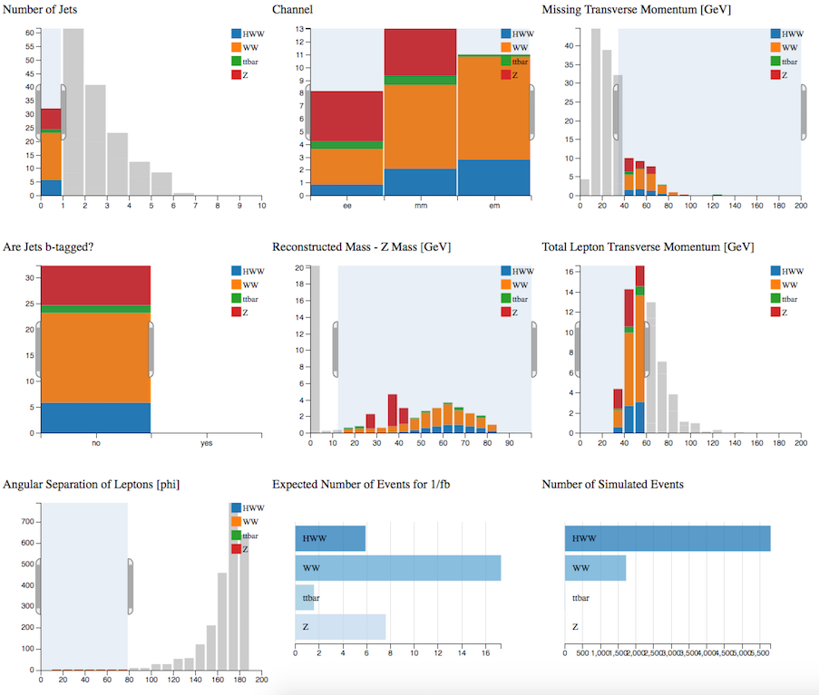

# Find the Higgs

Now let's try to separate the signal from the background:

## Higgs boson + 0 jet
We want to select events which contain two leptons, high MET and no jets.  

Select: 

* Njets = 0
* MET > 40 GeV
* ZWindow > 50 GeV
* SumLepPt < 80 GeV
* DeltaPhiLL < 80

The dominant background after all cuts in the
Higgs boson + 0 jet channel comes from WW
production, with a smaller contribution from top events.

## Higgs boson + 1 jet

We want to select events which contain two leptons, high MET and 1 non b-tagged jet.

Select: 

* Njet = 1
* Btag = no
* MET > 40 GeV
* SumLepPt < 30 GeV
* DeltaPhiLL < 80
* ZWindow > 15 GeV

The dominant background after all cuts in the
Higgs boson + 1 jet channel comes from WW
production.

## Have a go yourself !

Perhaps try the Higgs boson + 1 jet, but separate into leptonic channels and tune the cuts to maximise the number and purity of HWW events.  

Or try something completely different...

