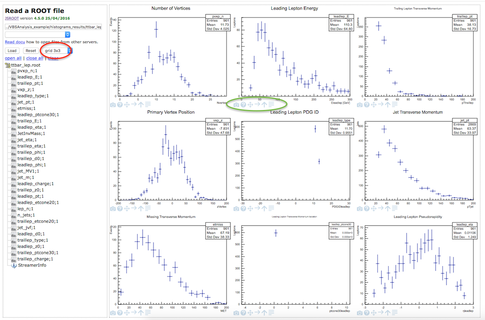

# ROOTbrowser

**A web based tool for displaying and analysing data and Monte-Carlo simulated data. 
**

There are two real datasets for you to look at
* data_Egamma.root
* data_Muons.root

Then there are a range of simulated datasets from 
* DY: Drell-Yan processes
* ggH: gluon+gluon->Higgs boson
* stop: superpartner of the top quark as predicted by supersymmetry.
* ttbar: top pair production
* VBF: Vector Boson Fusion
* W+jets: W boson decay to various final states
* WW: W boson pair
* WZ: W+Z boson
* Zee: Z boson decay to two electrons
* Zmumu: Z boson decay to two muons
* Zprime: superpartner of the Z boson as predicted by supersymmetry.
* Ztautau: Z decay to two taus
* ZZ: Z boson pair

Select a dataset using the drop-down menu (second text box).

The name of the dataset now appears in the top text box.
Press the "Load" button.

The available variables are then displayed.  Select the variable to view the distribution.

One or more datasets can be loaded.  

One or more variables can be displayed at a time.  Display options are available (grid option circled in red below) but the option must be selected before the file loaded.

Further display criteria available (circled in green below) such as setting the x-axis and/or y-axis to logarithmic scale.

Use the Reset button to clear your dataset selection.

