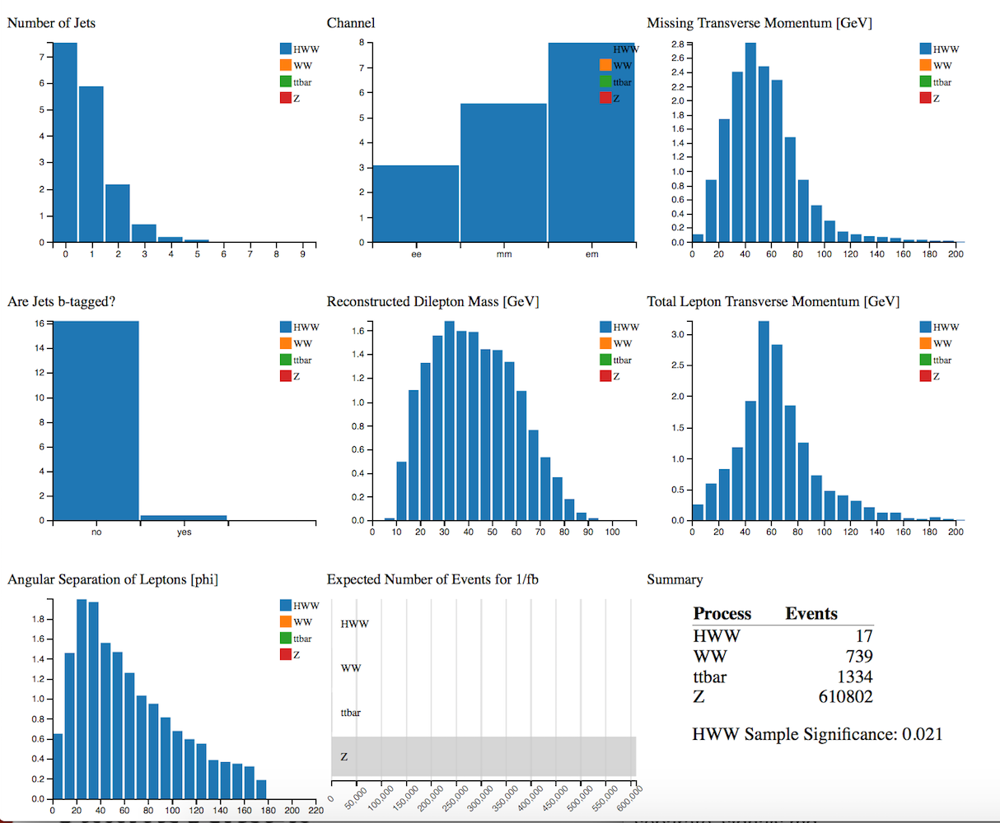
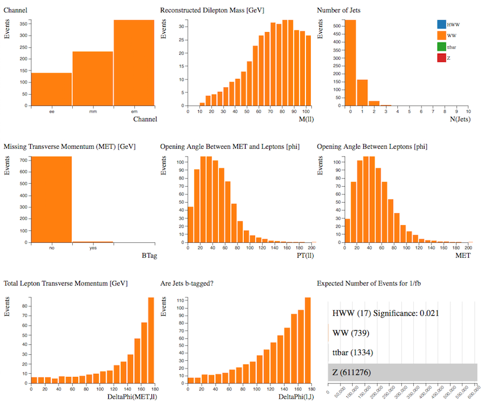
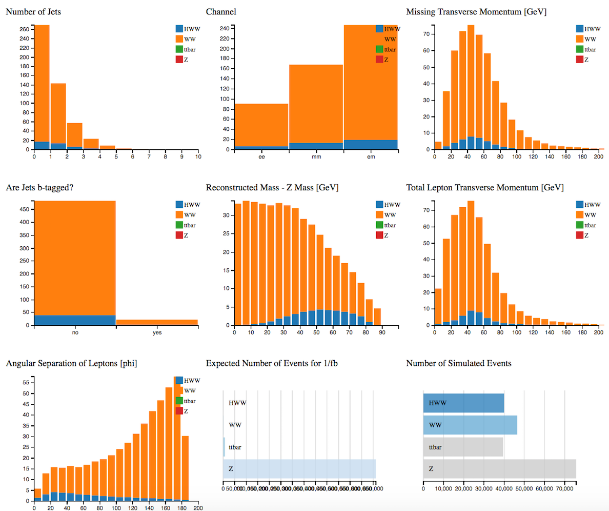
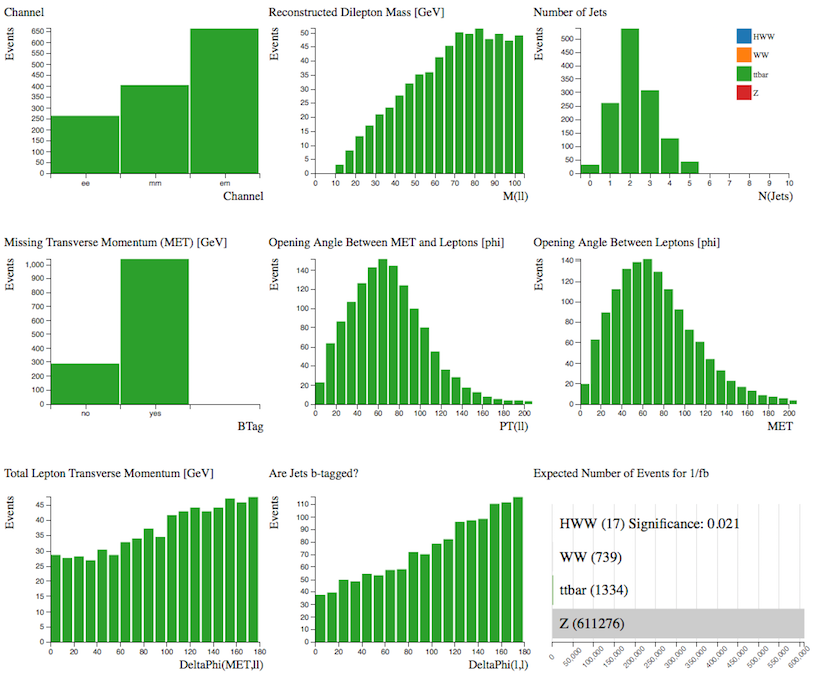

# Separate Signals

Let's look at the Monte Carlo simulated data.
Using the Histogram Analyser we can look at each sample separately and understand alittle more about its characteristics.  This will help us separate our signal from the background later.

**Select the sample by clicking on the bar in the Number of Simulated Events histogram.**  The rest of your histograms now just display the characteristics of your chosen sample.

## H→WW

**H->WW->ℓνℓν** (ℓ = electron, muon)

Our signal is the  Higgs boson which decays into 2 W bosons which subsequently decay into leptons and neutrinos. 

Let's look at the individual histograms:
* The majority of Higgs events contain 0 or 1 jet.
* The analysis considers electron or muon decay of the W bosons, so the events occur in all three channels.  
* Missing transverse momentum is due to the neutrinos in the final state.  
* Mostly non b-tagged jets.
* The Reconstructed Mass - Z mass distribution peaks at 50-55 GeV.
* The opening angle of the leptons from Higgs decay tends to be small.

## WW

Two W bosons both decaying leptonically.

Let's look at the individual histograms:
* The majority of WW events contain 0 or 1 jet.
* The analysis considers electron or muon decay of the W bosons, so the events occur in all three channels.  
* * Missing transverse momentum is due to the neutrinos in the final state.  
* Mostly non b-tagged jets.
* The opening angle of the leptons from WW decay tends to be large.

The distributions are not so different from those for HWW, hence it is a difficult background to remove.

Displaying both samples together shows why it is difficult to separate the HWW signal from the WW background.

## top quark pair

Looking at the individual histograms:
* The majority of WW events contain 2 or 3 jets.
* The events occur in all three channels.  
* Missing transverse momentum is due to the neutrinos in the final state.  
* Mostly b-tagged jets.  
* The opening angle of the leptons from top quark production are fairly evenly distributed over the whole phi range.

Histogram Analyser shows us that demanding non b-tagged jets, only 0 or 1 jet and small angular separation of leptons will reduce the top quark contribution.