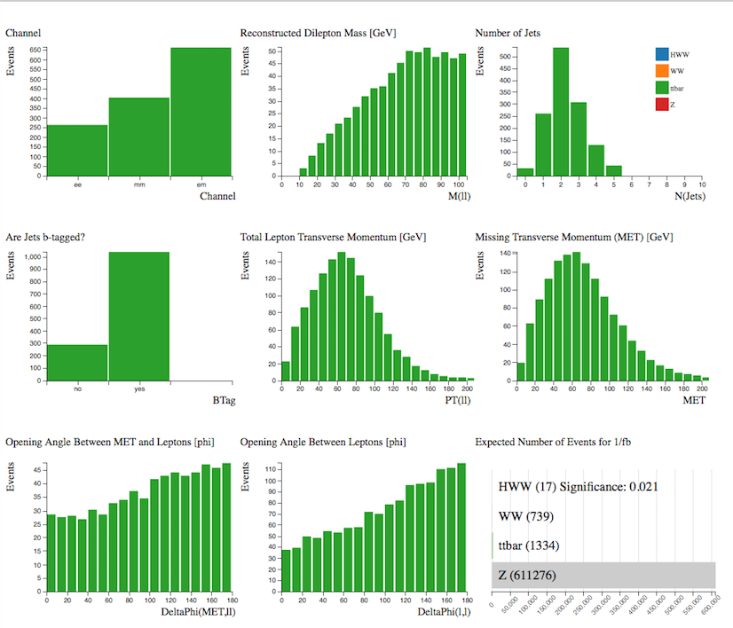

# Separate Signals

Let's look at the Monte Carlo simulated data.
Using the Histogram Analyser we can look at each sample separately and understand alittle more about its characteristics.  This will help us separate our signal from the background.

Select the sample by clicking on the bar in the Number of Simulated Events histogram.  The rest of your histograms now just display the charcteristics of your chosen sample.

## HWW

**H->WW->ℓνℓν** (ℓ = electron, muon)

Our signal is the  Higgs boson which decays into 2 W bosons which subsequently decay into leptons and neutrinos. 

## WW

Two W bosons both decaying leptonically.

## top quark pair

## HWW + WW

A major background contribution to the Higgs signal is WW events.  Displaying both samples together shows why it is difficult to separate the signal from the background.

