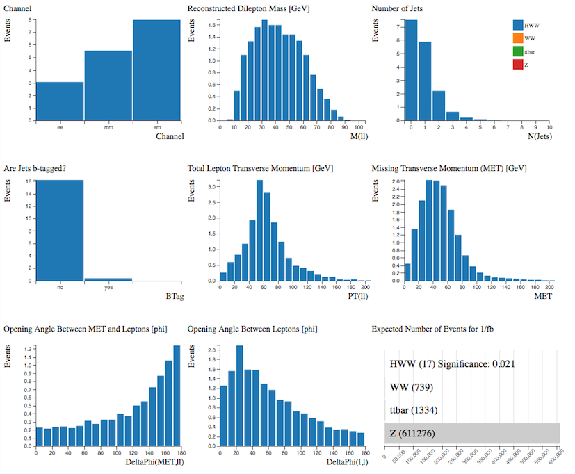

# Separate Signals

Let's look at the Monte Carlo simulated data.
Using the Histogram Analyser we can look at each sample separately and understand alittle about its characteristics.

Select the sample by clicking on the bar in the Number of Simulated Events histogram.  The rest of your histograms now just display the charcteristics of your chosen sample.

## HWW

## WW

## top quark pair

## HWW + WW

