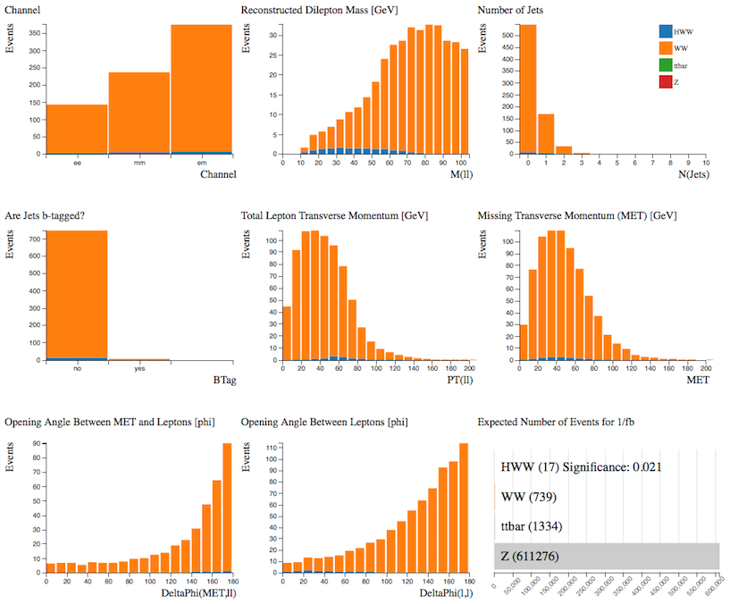

# Separate Signals

Let's look at the Monte Carlo simulated data.
Using the Histogram Analyser we can look at each sample separately and understand a little more about their characteristics.  This will help us separate our signal from the background later.

**Select the sample by clicking on the bar in the Expected Number of Events histogram.**  The rest of your histograms now just display the characteristics of your chosen sample.

## H→WW

**H→WW→ℓνℓν** (ℓ = electron, muon)

Our signal is the  Higgs boson which decays into 2 W bosons which subsequently decay into leptons and neutrinos. 

Let's look at the individual histograms:
* The analysis considers electron and muon decays of the Higgs boson, so the events occur in all three channels. 
* The reconstructed mass from the two leptons peaks at 25-45 GeV.
* The majority of Higgs events contain 0 or 1 jet.
* Most jets are not b-tagged jets. 
* The total lepton transverse momentum peaks around 60 GeV.  
* Missing transverse momentum is due to the neutrinos in the final state. 
* The opening angle between the missing transverse momentum and the leptons tends to be large.
* The opening angle of the leptons from Higgs decays tends to be small.

## WW

Two W bosons both decaying leptonically.

Let's look at the individual histograms:
* The analysis considers electron and muon decays of the W bosons, so the events occur in all three channels. 
* The reconstructed mass from the two leptons peaks at around 80 GeV.
* The majority of WW events contain 0 or 1 jet.
* Most jets are not b-tagged jets. 
* The total lepton transverse momentum peaks around 20-40 GeV.  
* Missing transverse momentum is due to the neutrinos in the final state. 
* The opening angle between the missing transverse momentum and the leptons tends to be large.
* The opening angle of the leptons from Higgs decays tends to be large.  Note this is different to the distribution for Higgs events.

Overall, the distributions are not so different from those for H→WW, hence it is a difficult background process to remove.

Displaying both samples together shows why it is difficult to separate the H→WW signal from the WW background.

## top quark pair

Due to its high mass and short lifetime, the top quark provides a unique environment to study a bare quark.

Looking at the individual histograms:

* The events occur in all three channels. 
* The reconstructed mass from the two leptons peaks at around 80 GeV.
* The majority of WW events contain 2 or 3 jets.
* Most jets are b-tagged jets. 
* The total lepton transverse momentum peaks around 60-70 GeV.  
* Missing transverse momentum is larger than seen in H→WW and WW events.
* The opening angle between the missing transverse momentum and the leptons is fairly evenly distributed over the whole phi range.
* The opening angle of the leptons from top quark production is fairly evenly distributed over the whole phi range, tending to slightly larger values.

Histogram Analyser shows us that demanding non b-tagged jets, only 0 or 1 jet, small angular separation of leptons and large angular separation between MET and leptons will reduce the top quark contribution.