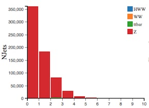

# The display histograms

App Analyser displays 9 histograms.
The description of each follows.

Let us consider two physics processes to understand which variables are important and why.

## top quark pair production

In the SM, the top-quark decays into a W-boson and a
b-quark with a branching ratio close to 100%.

W-bosons can decay either
* leptonically: into an electron or muon and neutrino. 
* hadronically: into an up-type quark and a down-type quark.

If a W-boson decays leptonically, the final state is characterised by the presence of a highly energetic isolated lepton and large missing transverse momentum due to the neutrino(s) escaping detection. 

If a W-boson decays hadronically, the final state is characterised by the presence of two jets due to the two quarks.

The two b-quarks from the top-quark decays will be seen as two jets in the final state.   

So if both W-bosons decay hadronically, 4 jets are seen.
If both W-bosons decay leptonically 2 jets are seen.
If the deacy is semi-leptonic, 1 W-boson decays letonically and the other hadronically, 3 jets are seen.

## NJets

Number of jets found in the event.

## Channel

Leptonic decay channels are shown here: di-electron (ee) , electron-muon (em) or muon-muon (mm) channel. Decays to taus or hadrons are not considered in this case.

## MET

In the LHC, the initial momentum of the colliding particles along the beam axis is not known because the energy of each proton is split, and constantly exchanged, between its constituents.  So the amount of total missing energy cannot be determined. 
However, the initial energy of particles travelling transverse to the beam axis is zero, so any net momentum in the transverse direction indicates missing transverse energy (MET).

Missing energy is commonly used to infer the presence of non-detectable particles such as the standard model neutrino and is expected to be a signature of many predicted physics events that contain particles that do not interact with the detector, for example the lightest supersymmetric particle.

Requiring MET removes Z+jets as it is does not have any neutrinos in the final state while the other processes do.

## BTag

This is the identification or "tagging" of jets originating from bottom quarks.

Btagged jets are expected in top quark decay, but not in leptonic W boson decay.

## ZWindow

This gives the deviation of the dilepton mass from the [Z boson mass](http://pdg.lbl.gov/2012/listings/rpp2012-list-z-boson.pdf) (91 GeV). For Z events this obviously peaks at 0 but for HWW it peaks away from 0.

## SumLepPt

This is the [vectorial sum](https://en.wikipedia.org/wiki/Euclidean_vector#Addition_and_subtraction) of the transverse momenta of the charged leptons observed. For the Z boson it peaks at 0 as the two leptons from the Z decay are relatively balanced against each other. For HWW you see that this distribution peaks at around 50.

## DeltaPhiLL

This is the opening angle in phi between the two leptons.

If the leptons are produced back-to-back, this is displayed on the histogram as 180 degrees.  Selecting DeltaPhiLL = 180 you will see that the majority of events contain Z bosons.  

Selecting DeltaPhiLL < 20 you will see the majority of events contain Higgs bosons.  Leptons from Higgs bosons tend to be close in phi.

## Fiducial cross section

This is an indicator of the purity of the selection. 

To start, we see mostly Z. 
Z production is quite pure since it has a large cross section.

Select only the em channel, then the number of Z bosons decreases substantially. 
Selecting 2 jets and the em channel, then we have mostly ttbar events.

## Raw number of events

When you are making cuts it is interesting to watch the relative number of events for the 4 processes.  You want to make selections that preferentially remove the unwanted processes (background) but leaves the signal process.
