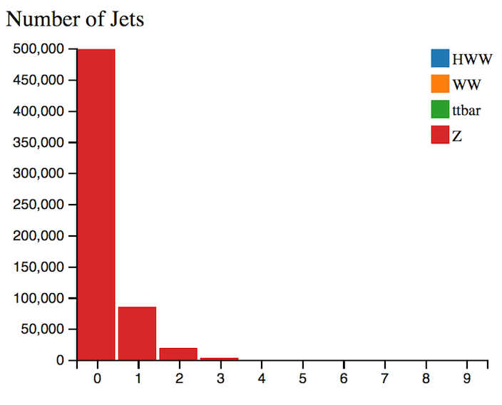

# The display histograms

App Analyser displays 9 histograms.
The description of each follows.

Let us first consider a physics process to understand which variables are important and why.

## top quark pair production

In the SM, the top-quark generally decays into a [W boson](https://en.wikipedia.org/wiki/W_and_Z_bosons) and a 
[b-quark](https://en.wikipedia.org/wiki/Bottom_quark).

W bosons can decay either
* [leptonically](https://en.wikipedia.org/wiki/Lepton): into an electron or [muon](https://en.wikipedia.org/wiki/Muon) and [neutrino](https://en.wikipedia.org/wiki/Neutrino). 
* [hadronically](https://en.wikipedia.org/wiki/Hadron): into an [up-type quark](https://en.wikipedia.org/wiki/Quark) and a [down-type quark](https://en.wikipedia.org/wiki/Quark).

If a W boson decays leptonically, the final state is characterised by the presence of a highly energetic isolated lepton and large missing transverse energy (MET) due to the neutrino(s) escaping detection. 

If a W boson decays hadronically, the final state is characterised by the presence of two jets due to the two quarks.

The two b-quarks from the top-quark decays will be seen as two jets in the final state.  Jets identified as originating from b-quarks are termed b-tagged jets.   

* If both W bosons decay hadronically, 4 jets are seen.
* If both W bosons decay leptonically 2 jets are seen.
* If the decay is semi-leptonic, 1 W boson decays leptonically and the other hadronically, 3 jets are seen.

Reconstruction of an event is not easy.  So not all jets will definitely be reconstructed, or indeed more jets may be reconstructed due to other activity.  The number of jets is not a absolute fixed quantity, but can be a good indicator of what is happening in an event.

The number and type of jets, amount of MET and lepton decay channel are therefore important variables describing an event.  

Understanding a physics process can help motivate cuts on variables to select or remove that particular physics process.

## Raw number of events

When you are making cuts it is interesting to watch the relative number of events for the 4 main processes; HWW, WW, ttbar and Z .  You want to make selections that preferentially remove the unwanted processes (background) but leave the desired process (signal).

This is the bottom right histogram.

## NJets

Number of jets found in the event.
With no selection, Z boson events are dominant.
**But other process not negigible, so why is Njets histogram predominantly red ?**

Selecting 2 or more jets, reduces the number of Z boson events and increases the proportion of ttbar events.
**But why does the Njet histogram remain red? (ie Z)**

## Channel

Leptonic decay channels are shown here: di-electron (ee) , electron-muon (em) or di-muon (mm) channel. Decays to taus or hadrons are not considered in this case.

## MET

In the LHC, the initial momentum of the colliding particles along the beam axis is not known because the energy of each proton is split, and constantly exchanged, between its constituents.  So the amount of total missing energy cannot be determined. 
However, the initial energy of particles travelling transverse to the beam axis is zero, so any net momentum in the transverse direction indicates missing transverse energy (MET).

Missing energy is commonly used to infer the presence of non-detectable particles such as the standard model neutrino and is expected to be a signature of many predicted physics events that contain particles that do not interact with the detector, for example the lightest [supersymmetric](http://home.cern/scientists/updates/2013/10/supersymmetry-searches-atlas) particle.

Requiring MET removes Z boson events as it is does not have any neutrinos in the final state while the other processes do.

## BTag

This is the identification or tagging of jets originating from bottom quarks.

Btagged jets are expected in top quark decay, but not in leptonic W boson decay.

## ZWindow

This gives the deviation of the dilepton mass from the [Z boson mass](http://pdg.lbl.gov/2012/listings/rpp2012-list-z-boson.pdf) (91 GeV). For Z boson events this obviously peaks at 0 but for HWW it peaks away from 0.

## SumLepPt

This is the [vectorial sum](https://en.wikipedia.org/wiki/Euclidean_vector#Addition_and_subtraction) of the transverse momenta of the charged leptons observed. For the Z boson it peaks at 0 as the two leptons from the Z boson decay are relatively balanced against each other. For HWW you see that this distribution peaks at around 50 GeV.

## DeltaPhiLL

This is the opening angle in phi between the two leptons.

If the leptons are produced back-to-back, this is displayed on the histogram as 180 degrees.  Selecting DeltaPhiLL = 180 you will see that the majority of events contain Z bosons.  

Selecting DeltaPhiLL < 20 you will see the majority of events contain Higgs bosons.  Leptons from Higgs bosons tend to be close in phi.

**But why does the fiducial cross section still show majority Z ?**

## Fiducial cross section

This is an indicator of the purity of the selection. 

A fiducial cross section is the cross section for particle production within the detector acceptance. 

An acceptance correction has to be applied to convert a fiducial cross section to a total cross section. This acceptance correction is easily obtained from Monte Carlo simulations, but it comes with a systematic uncertainty coming mainly from the Parton Distribution Functions.

Since modern theoretical tools can calculate fiducial cross sections accurately, it is not necessary to apply an acceptance correction in order to compare to theory. 

To start, with no selection, we see mostly Z boson production. 
Z boson production is quite pure since it has a large cross section.

Select only the em channel, then the number of Z bosons decreases substantially. 

Selecting 2 jets and the em channel, then we have mostly ttbar events.

