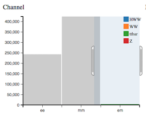
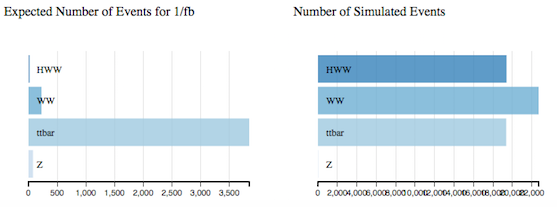
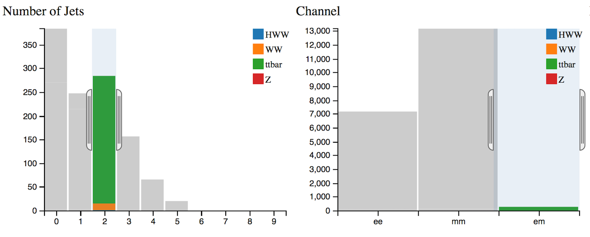
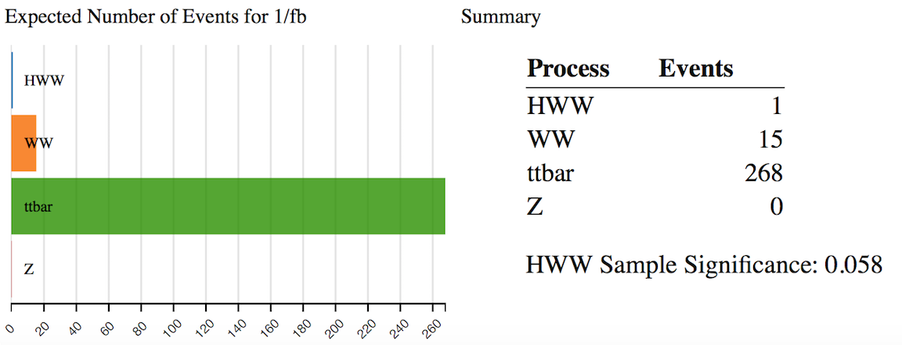
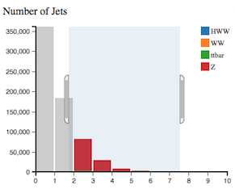
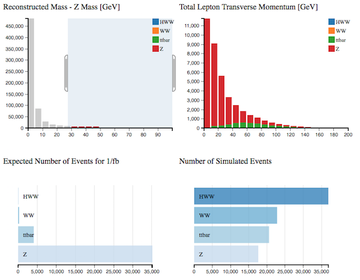
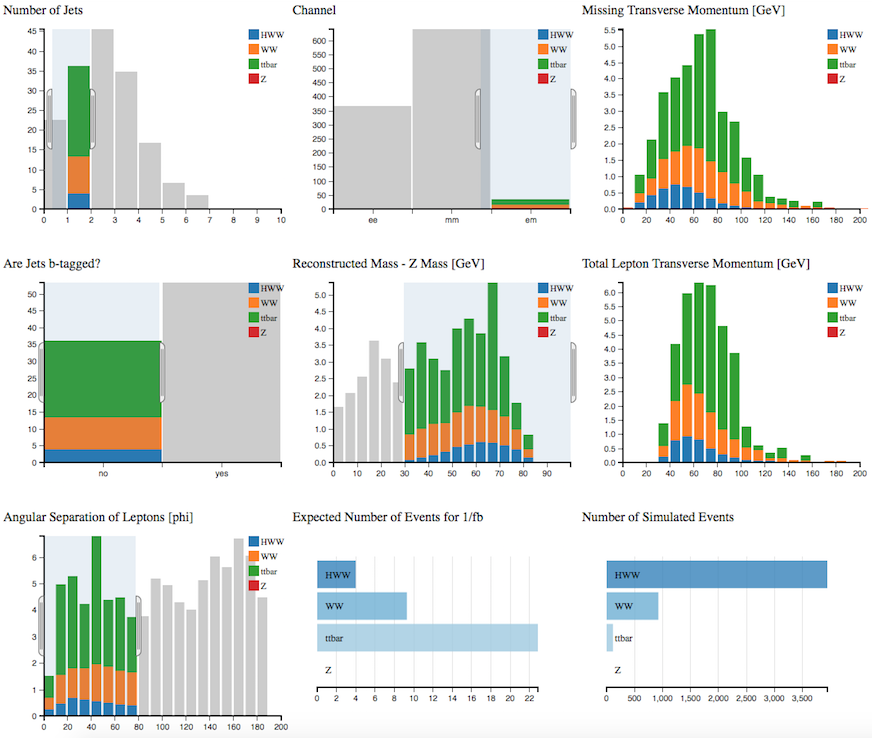
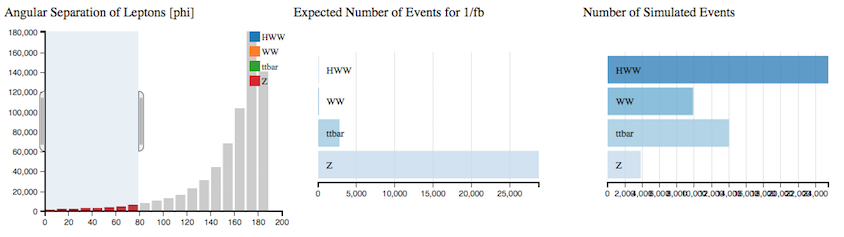

# The histograms explained

The Histogram App Analyser displays 9 histograms.
The description of each follows.

Let us first consider a physics process to understand which variables are important and why.

## Top quark pair production

In the SM, the top-quark generally decays into a [W boson](https://en.wikipedia.org/wiki/W_and_Z_bosons) and a 
[b-quark](https://en.wikipedia.org/wiki/Bottom_quark).

W bosons can decay either
* [leptonically](https://en.wikipedia.org/wiki/Lepton): into an electron or [muon](https://en.wikipedia.org/wiki/Muon) and [neutrino](https://en.wikipedia.org/wiki/Neutrino). 
* [hadronically](https://en.wikipedia.org/wiki/Hadron): into an [up-type quark](https://en.wikipedia.org/wiki/Quark) and a [down-type quark](https://en.wikipedia.org/wiki/Quark).

If a W boson decays leptonically, the final state is characterised by the presence of a highly energetic isolated lepton and large missing transverse momentum due to the neutrino(s) escaping detection. 

If a W boson decays hadronically, the final state is characterised by the presence of two jets due to the two quarks.

The two b-quarks from the top-quark decays will be seen as two jets in the final state.  Jets identified as originating from b-quarks are termed b-tagged jets.   

* If both W bosons decay leptonically two jets are seen, originating from the b-quarks.
* If both W bosons decay hadronically, six jets are seen, two from each W and two from the b-quarks.
* If the decay is semi-leptonic, one W boson decays leptonically and the other hadronically, four jets are seen.

Reconstruction of an event is not easy.  Not all jets will be reconstructed, or maybe more jets will be reconstructed due to other activity.  The number of jets reconstructed is not an accurate quantity, but can be a good indicator of what is happening in an event.

The number and type of jets, amount of missing transverse momentum and lepton decay channel are important variables describing an event.  

Understanding a physics process can help motivate cuts on variables to select or remove that particular physics process.

## Number of Simulated Events

This is the theoretical number of events produced in the different physics processes. 
It is displayed in the bottom right histogram.

## Expected Number of Events for 1/fb

This is the number of events expected to be detected, reconstructed and recorded by ATLAS with the datasets used here. 

The number of events detected and reconstructed by ATLAS is different to the theoretical number of events produced.  Some events will not be reconstructed due to the detector construction, detector resolution, reconstruction efficiency and other uncertainties.

The colouration of the 7 other histograms depends on the expected number of events for the different physics processes.

When you are making cuts it is interesting to watch the relative number of events for the 4 main processes; HWW, WW, ttbar and Z .  You want to make selections that preferentially remove the unwanted processes (background) but leave the desired process (signal).

Z boson production has a large cross section.
So at the start, with no selection, we see mostly Z boson production and the histograms coloured in red. 

Select only the electron-muon (em) channel, then the number of Z bosons decreases substantially. 
Z bosons decay to fermion-antifermion, so are seen in the electron-electron channel and the muon-muon channel, but not the electron-muon channel.  A small number of electrons or muons may be wrongly identified and hence a small number of Z bosons may be reconstructed in the electron-muon channel. 

Selecting 2 jets and the em channel we have mostly ttbar events.  Note the histograms are now coloured in green to reflect the ttbar contribution.

## Number of Jets

Number of jets found in the event.

With no selection, Z boson events are dominant.

Selecting 2 or more jets, increases the proportion of ttbar events.

## Channel

Leptonic decay channels are shown here: di-electron (ee) , electron-muon (em) and di-muon (mm) channels. Decays to taus or hadrons are not considered in this case.

## Missing Transverse Momentum [GeV]

In the LHC, the initial momentum of the colliding particles along the beam axis is not known because the energy of each proton is split, and constantly exchanged, between its constituents.  So the amount of total missing energy cannot be determined. 
However, the initial energy of particles travelling transverse to the beam axis is zero, so any net momentum in the transverse direction indicates missing transverse energy (MET).

Missing energy is commonly used to infer the presence of non-detectable particles such as the standard model neutrino and is expected to be a signature of many predicted physics events that contain particles that do not interact with the detector, for example the lightest [supersymmetric](http://home.cern/scientists/updates/2013/10/supersymmetry-searches-atlas) particle.

Requiring missing transverse momentum removes Z boson events as it is does not have any neutrinos in the final state while the other processes do.

## Are Jets b-tagged?

Jets originating from b-quarks are identified and tagged.

B-tagged jets are expected in top quark decay, but not in leptonic W boson decay.

## Reconstructed Mass - Z Mass [GeV]

This histogram displays the deviation of the reconstructed dilepton mass from the [Z boson mass](http://pdg.lbl.gov/2012/listings/rpp2012-list-z-boson.pdf). For Z boson events this obviously peaks at zero but for HWW it peaks away from zero.  

A cut of Reconstruced Mass - Z Mass > 30 GeV reduces the theoretical Z boson contribution and increases the HWW contribution, shown in the Number of Simulated Events.  

## Total Lepton Transverse Momentum [GeV]

This is the [vectorial sum](https://en.wikipedia.org/wiki/Euclidean_vector#Addition_and_subtraction) of the transverse momenta of the charged leptons observed. 

For the Z boson total lepton transverse momentum peaks at zero as the two leptons from the Z boson decay are produced back-to-back. The momentum of one lepton cancels out the momentum of the other.

For HWW (shown in blue) you see that the total lepton transverse momentum distribution peaks at around 50 GeV.

## Angular Separation of Leptons [phi]

This is the opening angle, phi, between the two leptons.

If the leptons are produced back-to-back, this is displayed on the histogram as 180 degrees.  Selecting Angular Separation = 180 you will see that the majority of events contain Z bosons.  

Selecting Angular Separation < 80 you will see the total number of Higgs bosons increases.  Leptons from Higgs bosons tend to be close in phi.
