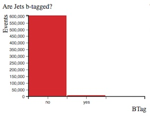
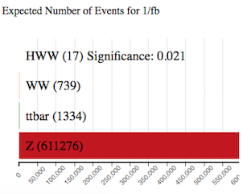
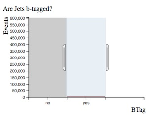
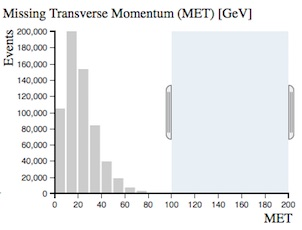
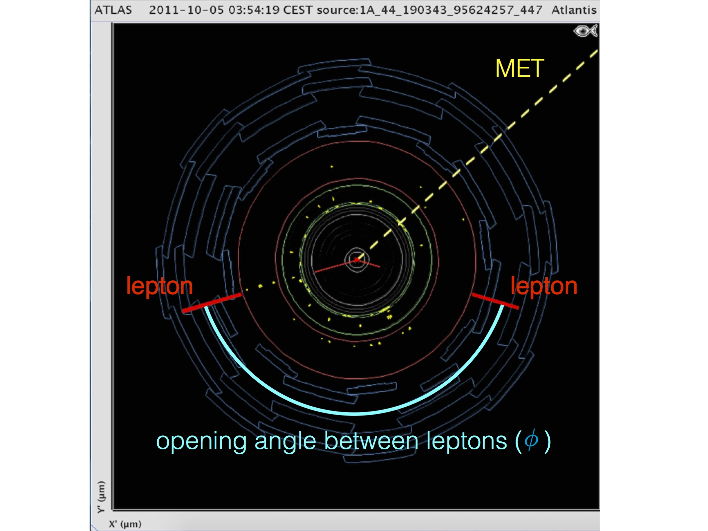

# Histogram Analyser

Physicists use cuts to select events of interest.  
Cuts preferentially remove the unwanted processes (background) but leave most of the desired process (signal). 
It is useful to have a good understanding of the physics processes involved when applying cuts.

The 4 processes displayed in Histogram Analyser are $$H\rightarrow W^+W^-$$, $$WW$$, $$t\bar t$$ and $$Z$$.
Each process is represented by a different colour. 

Make cuts using your cursor.
The selected ranges will be couloured, whilst non-selected ranges will be greyed out.
When you make cuts the contributions of the four processes will change.

**To clear your selection on a specific histogram click on the white background within the histogram area. **

**To clear all your selections click on "Histogram Analyser" under Get Started in the main top menu.**

## The histograms explained

Histogram Analyser displays 9 histograms.
The description of each follows.

## Expected Number of Events for $$\mathbf{1~fb^{-1}}$$

Histogram Analyser is displaying Monte-Carlo simulated events.
This histogram shows the number of events expected to be detected, reconstructed and recorded by ATLAS for 1 inverse femtobarn (1/fb) of data. 
One inverse femtobarn corresponds to approximately 100 trillion proton-proton collisions.

The number of events detected and reconstructed by ATLAS is different to the actual number of events produced.
Some events will not be reconstructed due to the detector construction, detector resolution, reconstruction efficiency and other inefficiencies.

With no cuts, we can see we have 17 $$H\rightarrow W^+W^-$$ events, with a total background of 612875 events.

The sample significance quantifies how "significant" the Higgs sample is with respect to the background.  It is calculated by $$(\text{Number of } H\rightarrow W^+W^- \text{events}) / \sqrt{\text{Number of background events}}$$).  The larger the significance value is, the better job you have done extracting the Higgs signal.

## Channel

The leptonic decay channels are shown here: di-electron (ee), di-muon (mm) and electron-muon (em).
Decays to taus or hadrons are not considered in Histogram Analyser.

## Reconstructed Dilepton Mass [GeV]

This histogram displays the mass reconstructed from the two leptons in the final state.
The variable describes the mass of an intermediate particle that has decayed to the two leptons.

With no cuts, this peaks at 90 GeV, due the huge [$$Z$$ boson](http://pdg.lbl.gov/2012/listings/rpp2012-list-z-boson.pdf) contribution.

We remove a large number of $$Z$$ boson events by selecting Reconstructed Dilepton Mass < 75 GeV, whilst hardly touching our Higgs signal.
The $$H\rightarrow W^+W^-$$ sample significance has increased from 0.021 to 0.110 with this cut.
It is thus a useful quantity to reduce the huge Z boson background.

## Number of Jets

Number of jets found in the event.

When selecting 2 or more jets we see the $$Z$$ boson contribution decreases and the $$t\bar{t}$$ contribution becomes more important.  
Top-quark pair production leads to $$WW$$+jets final states.

## Are Jets b-tagged?

Jets originating from b-quarks are identified and tagged using so-called b-tagging algorithms.

B-tagged jets are expected in top quark decays, but not in leptonic $$W$$ or $$Z$$ boson decays.

Selecting 'Are Jets b-tagged' as yes, we can see the ratio of ttbar to $$Z$$ events increases from 1334/611276 = 0.002 to 1041/7227 = 0.14 and the green ttbar contribution is now noticeable in the histograms.

## Missing Transverse Momentum (MET) [GeV]

In the LHC, the initial energy of the colliding partons (quarks or gluons) along the beam axis is not known.
This is due to the energy of each proton being shared and constantly exchanged between its constituents.  

However, the initial momentum of particles travelling transverse to the beam axis is zero.
Therefore, any net momentum in the transverse direction indicates missing transverse momentum.

Missing transverse momentum is used to infer the presence of non-detectable particles such as the neutrino.
It is expected to be a signature of many predicted physics events that contain particles that do not interact with the detector, for example the lightest [supersymmetric](http://home.cern/scientists/updates/2013/10/supersymmetry-searches-atlas) particle.

The standard abbreviation for missing transverse momentum is MET, for historical reasons.

$$Z$$ boson decays to charged leptons do not have any neutrinos in the final state while the other processes do.
That is why requiring missing transverse momentum removes $$Z$$ boson events.

Select missing transverse momentum and watch how the ratio of $$WW$$ and ttbar to $$Z$$ events changes.

## Total Lepton Transverse Momentum [GeV]

This is the [vectorial sum](https://en.wikipedia.org/wiki/Euclidean_vector#Addition_and_subtraction) of the transverse momenta of the observed charged leptons.

For $$Z$$ boson events, total lepton transverse momentum peaks at zero since the transverse momenta of both leptons cancel each other.

For the other processes this cancellation is not as pronounced.
Their distributions peak at between 30 and 80 GeV.

## Opening Angle Between Leptons [phi]

This is the opening angle, in phi (𝜙), between the two leptons.  

In the event display above, two lepton tracks are displayed in red and the opening angle between the two leptons is marked in blue.

If the leptons are emitted back-to-back, this is displayed on the histogram as 180 degrees.  
$$H\rightarrow W^+W^-$$events show a peak at low values in contrast to all other processes.

## Opening Angle Between MET and Leptons [phi]

This is the opening angle, in phi (𝜙), between the missing transverse momentum and the two leptons.

In the event display above, missing transverse energy is displayed by the dotted yellow line.  The midline between the two lepton tracks (the direction of the vectorial sum of their transverse momenta) is represented by the dotted red line.  The opening angle between the MET and leptons is shown in yellow.

$$t\bar t$$ and $$Z$$ events show a relatively flat distribution in this variable whereas $$H\rightarrow W^+W^-$$ and $$WW$$ peak at large values.

This is a useful discriminant to remove background events.

