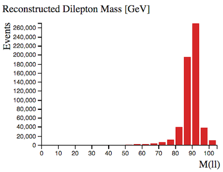

# Histogram Analyser

 Physicists use cuts to select events of interest.  
Cuts are made that preferentially remove the unwanted processes (background) but leave the desired process (signal).  It is useful to have a good understanding of the physics processes involved when applying cuts.

The 4 processes displayed in Histogram Analyser are H→WW, WW, ttbar and Z.  Each process is represented by a different colour. 

Make cuts using your cursor.  The selected ranges will be couloured, whilst non-selected ranges will be grey.  When you make cuts the relative quantities of the four processes will change.

**To clear your selection on a specific histogram click on the white background within the histogram area. **

**To clear all your selections click on "Histogram Analyser" under Get Started in the main top menu.**

## The histograms explained

Histogram Analyser displays 9 histograms.
The description of each follows.

## Expected Number of Events for 1/fb

Histogram Analyser is displaying Monte-Carlo simulated events.  The number of events expected to be detected, reconstructed and recorded by ATLAS for 1 inverse femtobarn (1/fb) of data is shown here. One inverse femtobarn corresponds to approximately 100 trillion proton-proton collisions.

The number of events detected and reconstructed by ATLAS is different to the actual number of events produced.  Some events will not be reconstructed due to the detector construction, detector resolution, reconstruction efficiency and other inefficiencies.

With no cuts, we can see we have 17 H→WW events, with a total background of 612875 events.

The sample significance quantifies how "significant" the Higgs sample is with respect to the background.  It is calculated by (Number of H→WW events) / Sqrt(Number of background events).  The larger the significance value is, the better job you have done extracting the Higgs signal.

## Channel

The leptonic decay channels are shown here: di-electron (ee), electron-muon (em) and di-muon (mm) channels. Decays to taus or hadrons are not considered in Histogram Analyser.

## Reconstructed Dilepton Mass [GeV]

This histogram displays the mass reconstructed from the two leptons in the final state.  

With no cuts, this peaks at 90 GeV, due the huge [Z boson](http://pdg.lbl.gov/2012/listings/rpp2012-list-z-boson.pdf) contribution.

Selecting Reconstructed Dilepton Mass < 75 GeV, we remove a large number of Z boson events, whilst hardly touching our Higgs signal.  The H→WW Sample Significance has increased from 0.021 to 0.110 with this cut.
It is therefore a very usefull quantity to reduce the huge Z boson background.

## Number of Jets

Number of jets found in the event.

When selecting 2 or more jets we see the Z boson contribution decreases and the ttbar contribution becomes more important.  
Top-quark pair production leads to WW+jets final states.

## Missing Transverse Momentum (MET) [GeV]

In the LHC, the initial energy of the colliding particles along the beam axis is not known because the energy of each proton is shared and constantly exchanged, between its constituents.  

However, the initial momentum of particles travelling transverse to the beam axis is zero, so any net momentum in the transverse direction indicates missing transverse momentum.

Missing transverse momentum is commonly used to infer the presence of non-detectable particles such as the neutrino.  It is expected to be a signature of many predicted physics events that contain particles that do not interact with the detector, for example the lightest [supersymmetric](http://home.cern/scientists/updates/2013/10/supersymmetry-searches-atlas) particle.

The standard abbreviation for missing transverse momentum is MET, for historical reasons.

Requiring missing transverse momentum removes Z boson events, since Z boson decay does not have any neutrinos in the final state while the other processes do.

## Opening Angle Between MET and Leptons [phi]

This is the opening angle, in phi (𝜙), between the missing transverse momentum and the two leptons.

This is a useful discriminant to remove background events.

## Opening Angle Between Leptons [phi]

This is the opening angle, in phi (𝜙), between the two leptons.

If the leptons are produced back-to-back, this is displayed on the histogram as 180 degrees.  

## Total Lepton Transverse Momentum [GeV]

This is the [vectorial sum](https://en.wikipedia.org/wiki/Euclidean_vector#Addition_and_subtraction) of the transverse momenta of the observed charged leptons.

For Z boson events, total lepton transverse momentum peaks at zero since the momentum of one lepton cancels out the momentum of the other.

## Are Jets b-tagged?

Jets originating from b-quarks are identified and tagged.
Such jets are identified from tracks that do not  originate from the proton collision point.

B-tagged jets are expected in top quark decays, but not in leptonic W boson decays.

