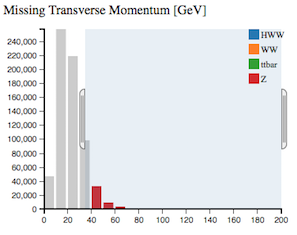
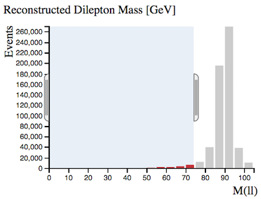

# Histogram Analyser

Physicists use cuts to select events of interest.  
Cuts are made that preferentially remove the unwanted processes (background) but leave the desired process (signal).  It is useful to have a good understanding of the physics processes involved when applying cuts.

The colours used in the histograms depend on the expected number of events for the different physics processes.  When you are making cuts it is interesting to watch the relative number of events for the 4 main processes: H→WW, WW, ttbar and Z.  

Make cuts using your cursor.  The selected ranges will be couloured, whilst non-selected ranges will be grey.

## The histograms explained

Histogram Analyser displays 8 histograms.
The description of each follows.

## Expected Number of Events for 1/fb

Histogram Analyser is displaying Monte-Carlo simulated events.  The number of events expected to be detected, reconstructed and recorded by ATLAS for 1 inverse femtobarn (1/fb) of data is shown here. One inverse femtobarn corresponds to approximately 100 trillion proton-proton collisions.

The number of events detected and reconstructed by ATLAS is different to the actual number of events produced.  Some events will not be reconstructed due to the detector construction, detector resolution, reconstruction efficiency and other inefficiencies.

With no cuts, we can see we have 17 H→WW events, with a total background of 612875 events.

The sample significance quantifies how "significant" the Higgs sample is with respect to the background.  It is calculated by (Number of H→WW events) / Sqrt(Number of background events).  The larger the significance value is, the better job you have done extracting the Higgs signal.

## Number of Jets

Number of jets found in the event.

With no selection, Z boson events are dominant and all the histograms are coloured red.

When selecting 2 or more jets we see the Z boson contribution decreases and the ttbar contribution becomes more important.  We see the ttbar contribution in green.

Top-quark pair production leads to WW+jets final states.

## Channel

The leptonic decay channels are shown here: di-electron (ee), electron-muon (em) and di-muon (mm) channels. Decays to taus or hadrons are not considered in this case.

When selecting only 2 jets and the em channel we see mostly ttbar events.  Note the histograms are now coloured in green to reflect the ttbar contribution.

## Missing Transverse Momentum [GeV]

In the LHC, the initial energy of the colliding particles along the beam axis is not known because the energy of each proton is shared and constantly exchanged, between its constituents.  

However, the initial momentum of particles travelling transverse to the beam axis is zero, so any net momentum in the transverse direction indicates missing transverse momentum.

Missing transverse momentum is commonly used to infer the presence of non-detectable particles such as the neutrino.  It is expected to be a signature of many predicted physics events that contain particles that do not interact with the detector, for example the lightest [supersymmetric](http://home.cern/scientists/updates/2013/10/supersymmetry-searches-atlas) particle.

Requiring missing transverse momentum removes Z boson events, since Z boson decay does not have any neutrinos in the final state while the other processes do.

## Reconstructed Dilepton Mass [GeV]

This histogram displays the mass reconstructed from the two leptons in the final state.  

With no cuts, this peaks at 90 GeV, due the huge [Z boson](http://pdg.lbl.gov/2012/listings/rpp2012-list-z-boson.pdf) contribution.

Selecting Reconstructed Dilepton Mass < 75 GeV, we cut alot of the Z boson events, whilst hardly touching our Higgs signal.  The HWW Sample Significance has increased from 0.021 to 0.114 with this cut.
It is therefore a very usefull quantity to reduce the huge Z boson background.

## Total Lepton Transverse Momentum [GeV]

This is the [vectorial sum](https://en.wikipedia.org/wiki/Euclidean_vector#Addition_and_subtraction) of the transverse momenta of the observed charged leptons. 

For Z boson events, total lepton transverse momentum peaks at zero since the momentum of one lepton cancels out the momentum of the other.

## Angular Separation of Leptons [phi]

This is the opening angle, phi (𝜙), between the two leptons.

If the leptons are produced back-to-back, this is displayed on the histogram as 180 degrees.  
